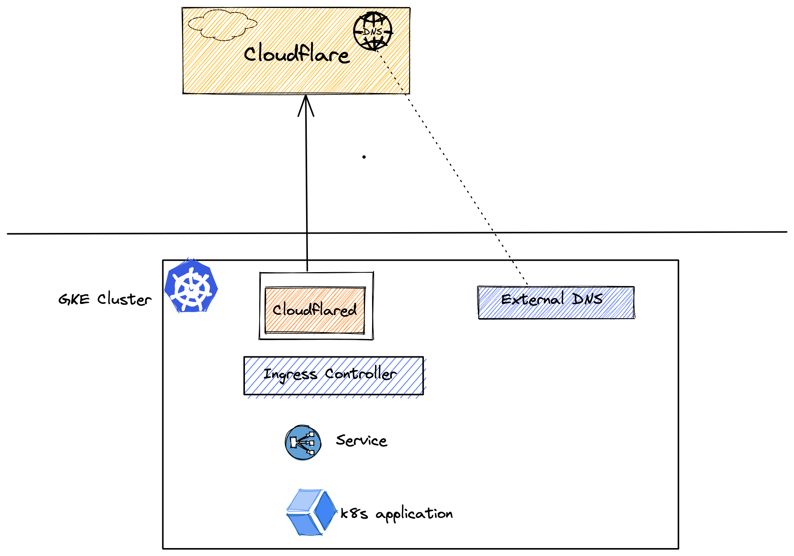

# Cloudflare GKE
Google Cloud Kubernetes Cluster with Nginx Ingress Controller behind Cloudflare Tunnel - Proof of Concepts

This repo contains a proof of concepts on how to leverage Cloudflare's argo tunnels without publicly exposing our services. In this setup we'll use [Google Kubernetes Engine (GKE)](https://cloud.google.com/kubernetes-engine/) as an example, but this works with other services as well.

### What is an Argo Tunnel?
[Argo Tunnel](https://developers.cloudflare.com/cloudflare-one/connections/connect-apps/) provides a secure way to connect your origin to Cloudflare without a publicly routable IP address. With Argo Tunnel, you do not expose an external IP from your infrastructure to the Internet. Instead, a lightweight daemon runs in your infrastructure and creates outbound-only connections to Cloudflare’s edge.

Argo Tunnel offers an easy way to expose web servers securely to the internet, without opening up firewall ports and configuring ACLs. Argo Tunnel also ensures requests route through Cloudflare before reaching the web server, so you can be sure attack traffic is stopped with Cloudflare’s WAF and Unmetered DDoS mitigation, and authenticated with Access if you’ve enabled those features for your account

There are tons of use cases like using exposing internal applications, replacing VPN setup with Cloudflare Access possibilities!

### Architecture: 

## Requirements

- Terraform version 4.19.0+
- GCP (Google Cloud) CLI setup and [authenticated to a GCP project](https://cloud.google.com/sdk/gcloud/reference/auth/application-default/login) with compute access. 
- Helm CLI [installed](https://helm.sh/docs/intro/install/)
- Domain Name that is controlled by CloudFlare.

## Deployment
